# Beatseeker - A Concert Ticketing System

## What is Beatseeker?

**BeatSeeker** is an innovative concert-focused ticketing platform designed to streamline the process of purchasing and promoting concert tickets. Unlike general ticketing systems like TicketMaster, BeatSeeker specializes in providing a user-friendly experience specifically tailored to concert enthusiasts. With easy integration for new venues and customizable seat selection, BeatSeeker is a one-stop solution for an enjoyable concert-going experience."

## Why was Beatseeker created?

Initially conceived as a mandatory project for one of our courses, this endeavor aimed to familiarize us with **Jira**, **GitHub**, **user story creation**, **task management**, and **feature development**. Our task was to develop a straightforward system, adhering to specific requirements provided through Jira. However, my team ([Abdullah Al Mamun Fahim](https://github.com/aamfahim), [Andrii Sych](https://github.com/SychAndrii), [Cleo Buenaventura](https://github.com/cleobnvntra)) and I were determined to showcase our expertise and explore the full extent of our capabilities within the five-week timeframe. We are proud of the final outcome, which not only fulfilled the user requirements but also incorporated genuine interactivity. This included the integration of **Stripe** for secure credit card transactions, password reset **confirmation codes**, and the delivery of **PDF tickets** directly to customers upon purchase. Our project serves as a testament to our dedication and ability to exceed expectations.

## Challenges

    - Learning Django
    - Researching the Domain
    - Email Confirmations
    - Currencies and Languages

## Recreating the React-Feeling

At the time, my team and I had a good grasp of how React behaved and felt, even though we hadn't formally learned it back then. We were captivated by its utility and design principles, and we deeply wanted to incorporate that sort of experience into our project. Given our situation, we decided to take a proactive approach: we recreated the feel of **React** using only native **JavaScript**. This endeavor not only provided us with a smooth **React-like** experience but also deepened our understanding of the framework's underlying mechanics.

## Screenshots of Beatseeker

### Dark Mode

#### Home Page

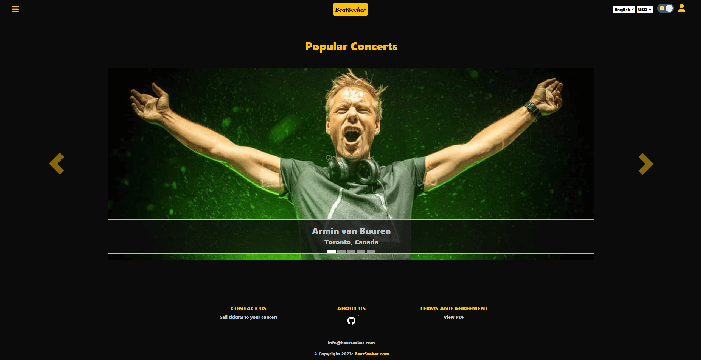

#### Concert Search Page

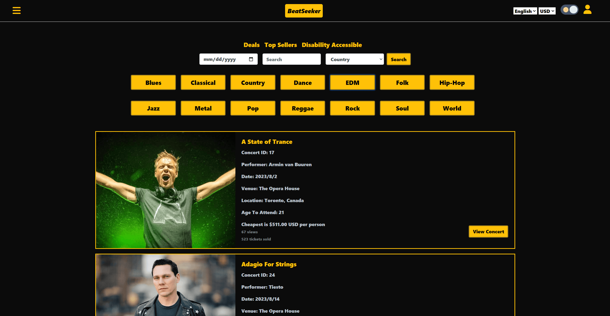

#### Concert Page

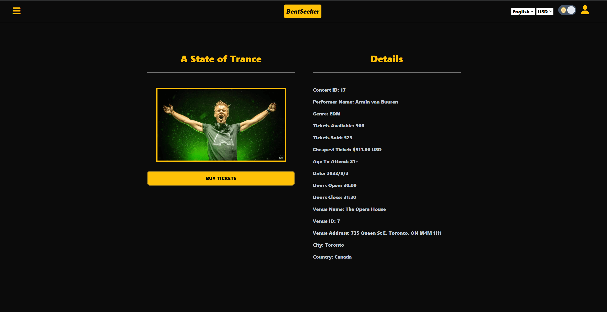

#### Ticket Purchasing

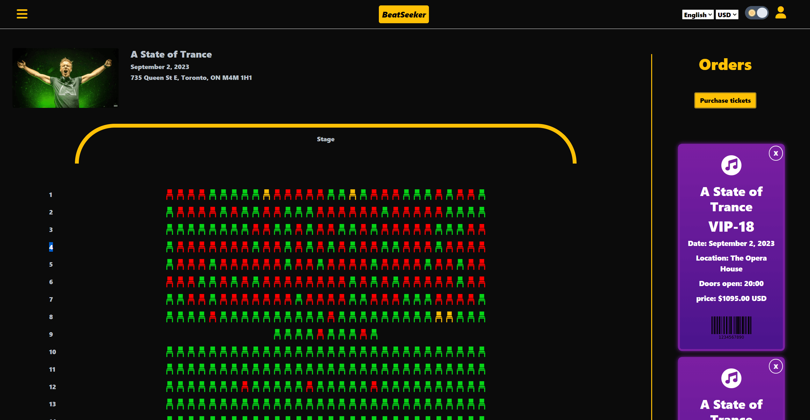

#### Payment

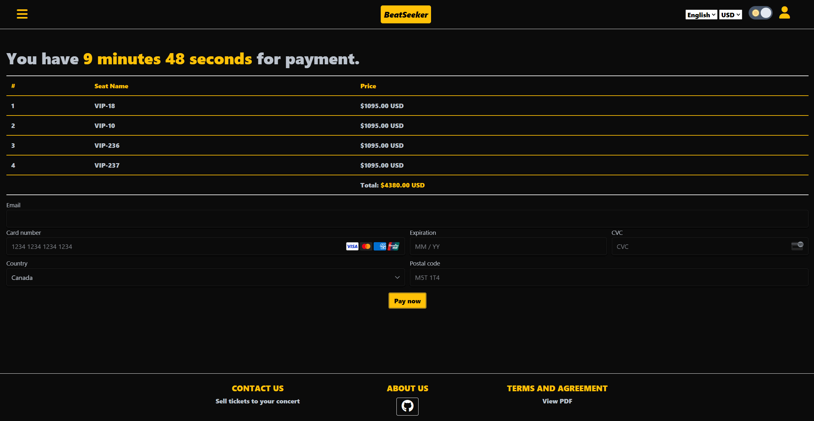

#### Login

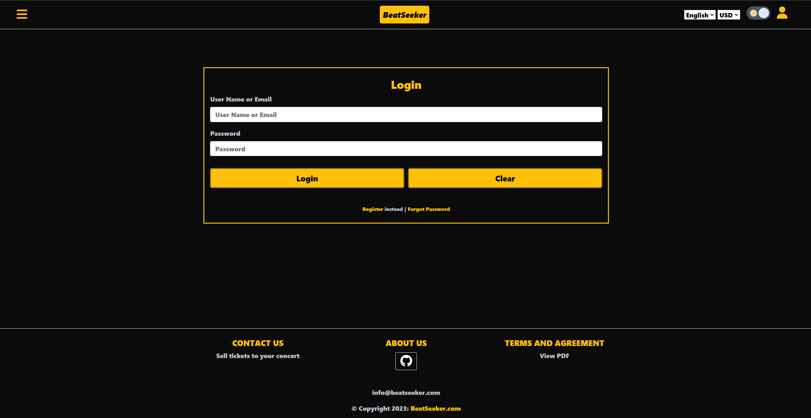

#### Admin Panel

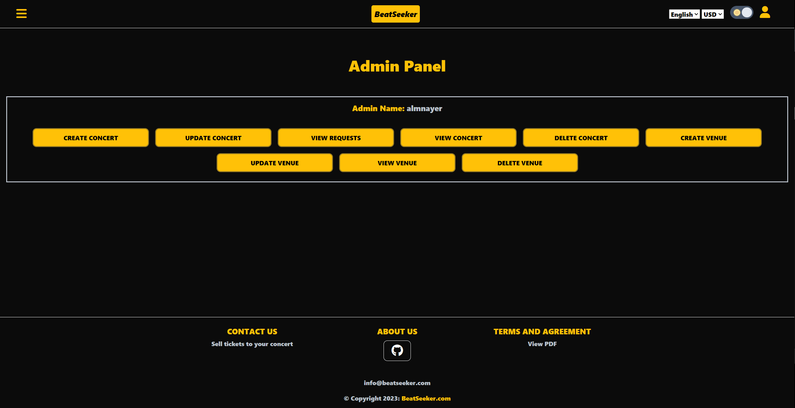

#### Concert Creation

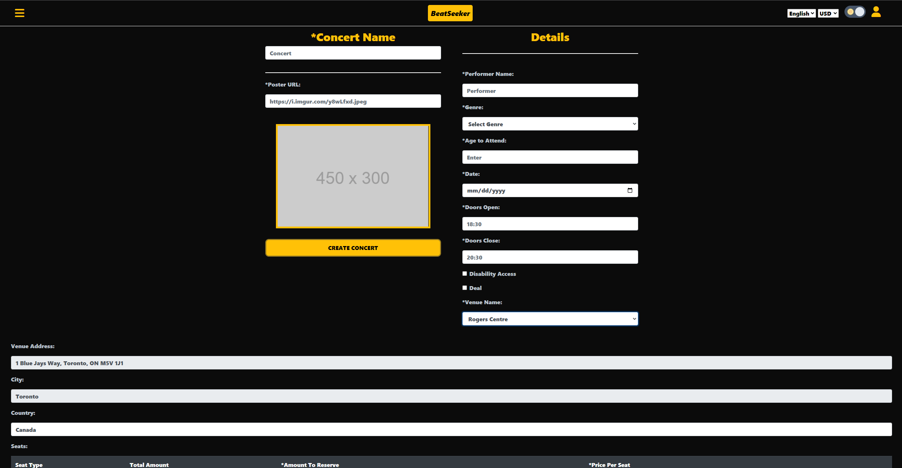

#### User Profile

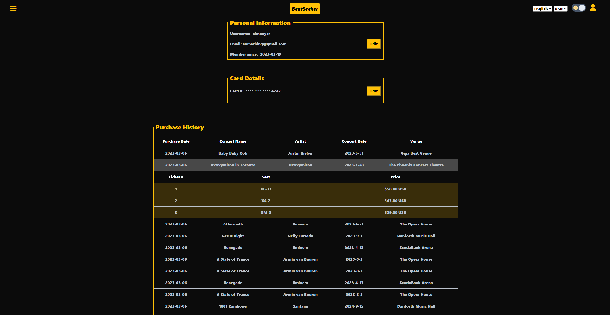

### Light Mode

#### Home Page

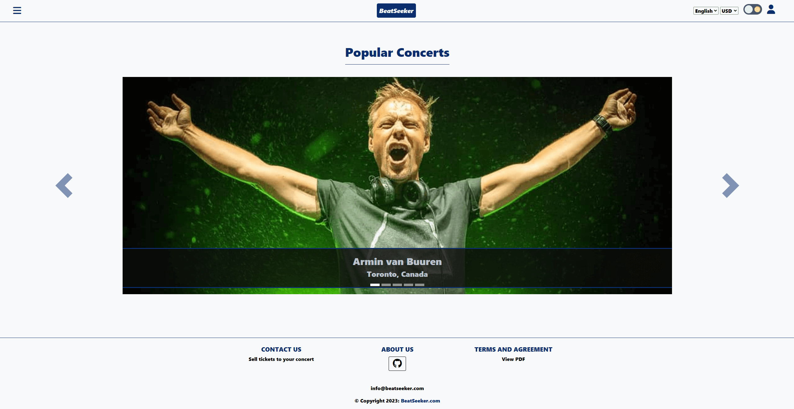

#### Concert Search Page

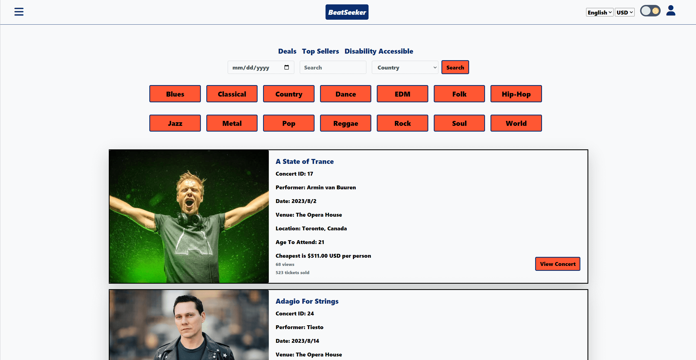

#### Concert Page

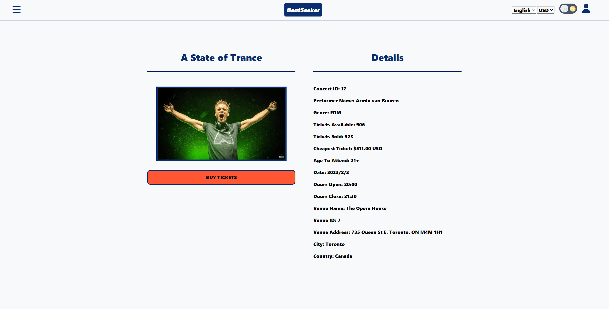

#### Ticket Purchasing

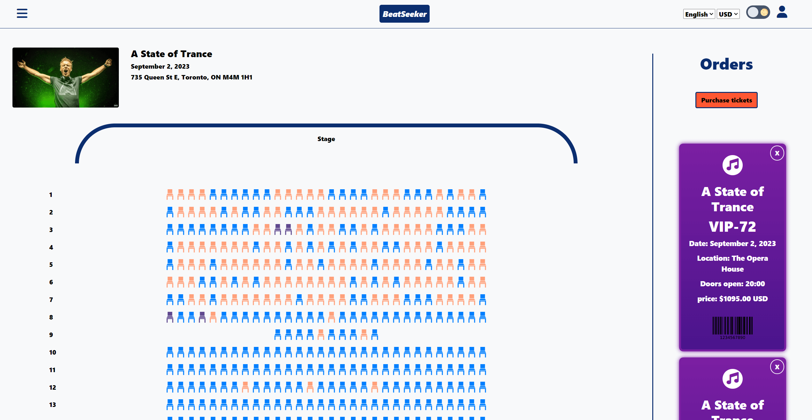

#### Payment

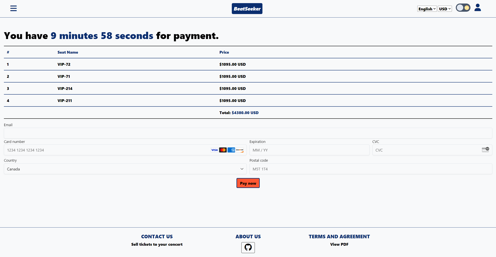

#### Login

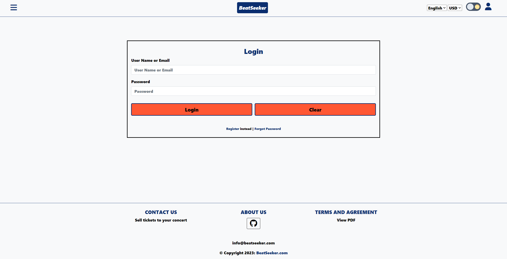

#### Admin Panel

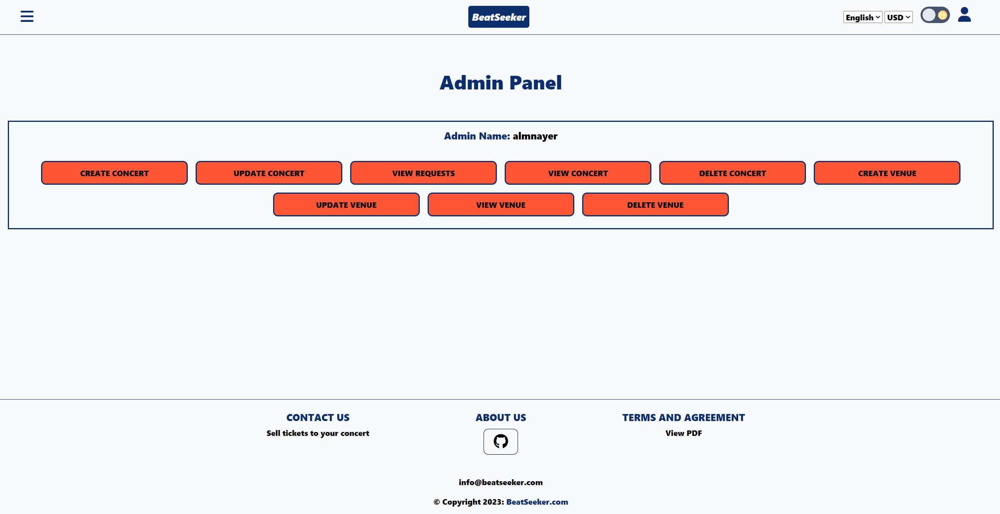

#### Concert Creation

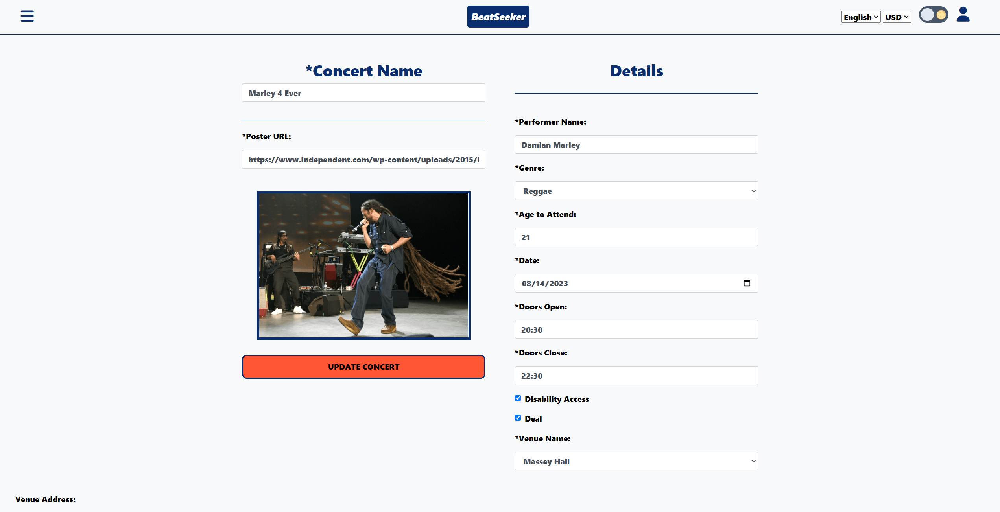

#### User Profile

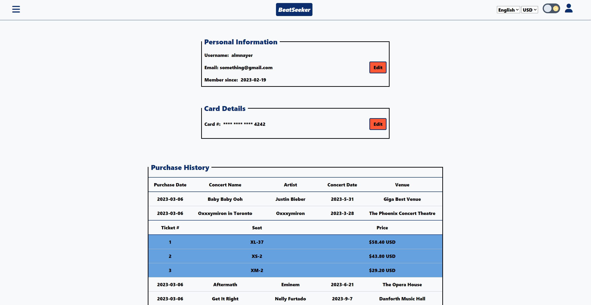
